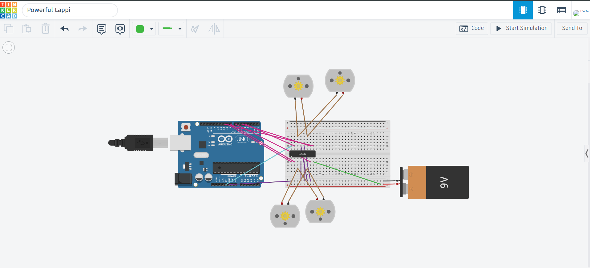
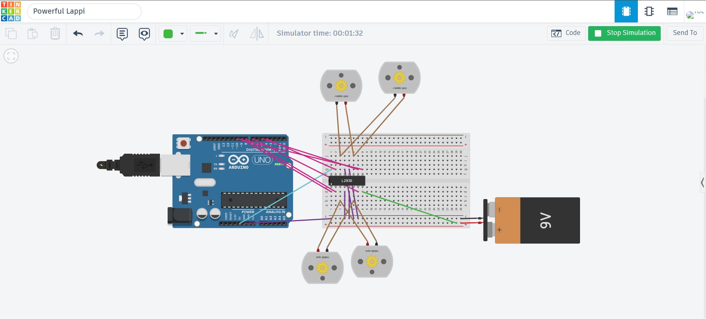
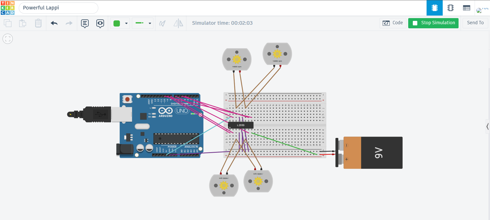

# 4 DC Motors Control using Arduino Uno and L293D Motor Driver

## Project Overview

This project demonstrates how to control **four DC motors** using an **Arduino Uno** and an **L293D Motor Driver** in **Tinkercad**.

The motors are controlled through the L293D H-Bridge motor driver, which allows the Arduino to change the rotation direction of each motor by sending digital control signals.

The project performs the following movement sequence automatically:

- Move Forward for **30 seconds**
- Move Backward for **60 seconds**
- Turn Right for **30 seconds**
- Turn Left for **30 seconds**
- Stop for **2 seconds**
- Repeat the sequence continuously

This project demonstrates the basic principles of DC motor control and robot movement using an H-Bridge motor driver.

---

# Objectives

- Learn how to interface an Arduino Uno with an L293D Motor Driver.
- Understand the operation of an H-Bridge motor driver.
- Control the direction of DC motors.
- Use an external power source for motors.
- Simulate motor control using Tinkercad.
- Program sequential robot movements using Arduino.

---

# Components Used

- Arduino Uno
- L293D Motor Driver IC
- 4 × DC Motors
- Breadboard
- 9V Battery
- Jumper Wires
- Tinkercad Circuits

---

# Software Used

- Tinkercad Circuits
- Arduino IDE (Arduino C++)

---

# Circuit Connections

## Arduino → L293D

| Arduino Pin | L293D Pin | Function |
|-------------|-----------|----------|
| D9 | Pin 1 | Enable 1,2 |
| D8 | Pin 2 | Input 1 |
| D7 | Pin 7 | Input 2 |
| D10 | Pin 9 | Enable 3,4 |
| D5 | Pin 10 | Input 3 |
| D4 | Pin 15 | Input 4 |

---

## Power Connections

| Source | L293D Pin | Description |
|---------|-----------|-------------|
| Arduino 5V | Pin 16 | Logic Power Supply |
| Arduino GND | Pins 4,5,12,13 | Common Ground |
| Battery +9V | Pin 8 | Motor Power Supply |
| Battery GND | Arduino GND | Common Ground |

---

## Motor Connections

| Motors | L293D Output Pins |
|---------|-------------------|
| Top Motors Group | Pins 3 & 6 |
| Bottom Motors Group | Pins 11 & 14 |

The four motors are connected as two functional pairs:

- Top-side motor pair
- Bottom-side motor pair

Each pair operates together to control the robot's movement.

---

# How the Circuit Works

The Arduino sends HIGH and LOW signals to the L293D input pins.

The L293D changes the polarity supplied to the motors, allowing them to rotate forward or backward.

The Enable pins receive PWM signals to activate the motors at full speed.

The motors are powered by an external 9V battery, while the Arduino supplies only the control signals.

---

# Movement Sequence

## Step 1 – Move Forward

The Arduino drives both motor groups in the forward direction.

**Duration:** 30 Seconds

---

## Step 2 – Move Backward

The motor polarity is reversed, causing all motors to rotate backward.

**Duration:** 60 Seconds

---

## Step 3 – Turn Right

One group of motors rotates forward while the opposite group rotates backward to execute a turn.

**Duration:** 30 Seconds

---

## Step 4 – Turn Left

The motor rotation directions are swapped between groups to reverse the turn direction.

**Duration:** 30 Seconds

---

## Step 5 – Stop

All motors stop before repeating the movement sequence.

**Duration:** 2 Seconds

---

# Arduino Program

The Arduino program is divided into several functions:

- setup()
- moveForward()
- moveBackward()
- turnRight()
- turnLeft()
- stopMotors()
- loop()

Each function changes the logic applied to the L293D input pins to generate the required movement.

---

# Understanding the RPM Indicator in Tinkercad

During the simulation, Tinkercad displays the rotational speed of each DC motor as **RPM (Revolutions Per Minute)**.

Besides showing the motor speed, the RPM value also indicates the motor rotation direction.

- **Positive RPM** (for example: **14886 RPM**) means the motor rotates **clockwise (forward direction)**.
- **Negative RPM** (for example: **-14886 RPM**) means the motor rotates **counterclockwise (reverse direction)**.

Monitoring the RPM values during the simulation confirms that the motors perform the required movements correctly.

---

# Circuit Diagram

**Figure 1:** Complete wiring diagram showing the Arduino Uno, L293D motor driver, four DC motors, breadboard, jumper wires, and external 9V battery.

---

# Forward Movement

**Figure 2:** Forward movement.

During this stage:

- All four motors rotate in the same forward direction.
- The RPM values have the same positive direction (**14886 RPM**).
- The synchronized motor rotation moves the robot forward for **30 seconds**.

---

# Backward Movement

**Figure 3:** Backward movement.

During this stage:

- All four motors rotate together in the reverse direction.
- The RPM values become negative (**-14886 RPM**), indicating reverse rotation.
- The robot moves backward for **60 seconds**.

---

# Turning Movement

## Turn Right

**Figure 4:** Right turn movement.

During turning right:

- The bottom motors group rotates forward displaying **positive RPM (14886 RPM)**.
- The top motors group rotates backward displaying **negative RPM (-14886 RPM)**.
- Rotating both groups in opposite directions enables the robot to execute the right turn successfully.

---

## Turn Left

**Figure 5:** Left turn movement.

During turning left:

- The top motors group rotates forward displaying **positive RPM (14886 RPM)**.
- The bottom motors group rotates backward displaying **negative RPM (-14886 RPM)**.
- This confirms that the L293D motor driver correctly controls the polarity and direction of the motors during turning.

---

# Simulation Video

The demonstration video shows the complete operation of the project, including:

- Circuit setup
- Forward movement
- Backward movement
- Right turn
- Left turn
- Complete movement sequence

[Click here to watch the project demonstration video](4-DC%20Motor%20Control%20Project.mp4)

---

# Project Structure

- **4-DC-Motors-Control**
  - `4-DC Motor Control Project.ino` — Arduino Source Code
  - `4-DC Motor Control Project.brd` — Board Layout File
  - `README.md` — Project Documentation
  - `Circuit.png` — Circuit Diagram
  - `Forward.png` — Forward Movement Simulation
  - `Backward.png` — Backward Movement Simulation
  - `TurnRight.png` — Right Turn Simulation
  - `TurnLeft.png` — Left Turn Simulation
  - `4-DC Motor Control Project.mp4` — Demonstration Video

---

# What I Learned

Through this project, I learned how to:

- Connect an Arduino Uno with an L293D motor driver.
- Use an H-Bridge to control the direction of DC motors.
- Connect multiple DC motors using grouped outputs.
- Supply motors with an external power source.
- Control motor movement using Arduino programming.
- Use PWM enable pins to activate motor outputs.
- Simulate electronic circuits using Tinkercad.
- Interpret RPM values to verify motor direction and movement.
- Troubleshoot wiring and motor control issues.

---

# Skills Gained

- Arduino Programming
- DC Motor Control
- L293D Motor Driver
- Tinkercad Circuit Simulation
- Breadboard Wiring
- Electronic Circuit Design
- Embedded Systems Fundamentals
- Robot Motion Control
- Hardware Troubleshooting

---

# Conclusion

This project successfully demonstrates the control of four DC motors using an Arduino Uno and an L293D motor driver.

The simulation verifies forward movement, backward movement, right turning, and left turning using different motor directions.

The RPM indicators in Tinkercad confirm that the motors rotate in the expected directions during each movement, making the project a practical introduction to robotic motion control and embedded systems.
